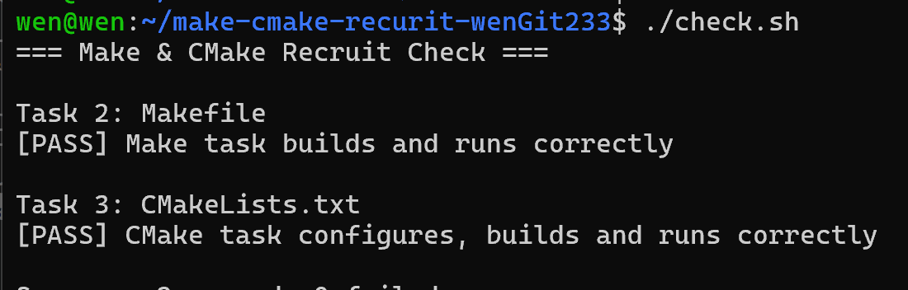

# Task 4：思考题

## 1. Make 和简单的 build.sh 有什么区别？
build.sh是shell 脚本：按顺序一条条执行命令，每次全部执行一遍
Make对比源文件和目标文件的修改时间，执行新修改的

## 2. CMake 是编译器吗？
不是
 `cmake --build build` 时，最终是谁在编译 C 源文件？
 gcc
## 3. 为什么不希望每次都重新编译所有 `.c` 文件？
重复执行已执行过的代码，浪费时间，在处理大量编译内容时效率低  

